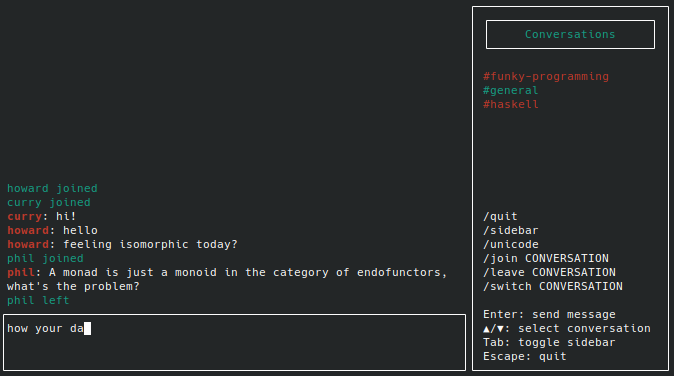
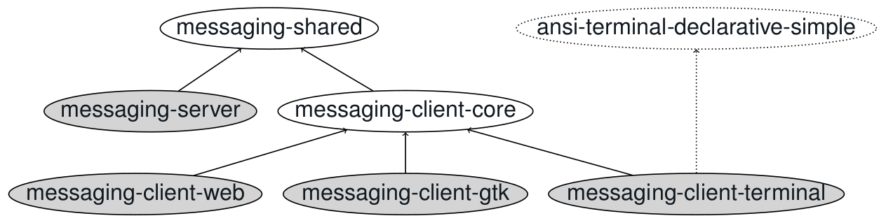
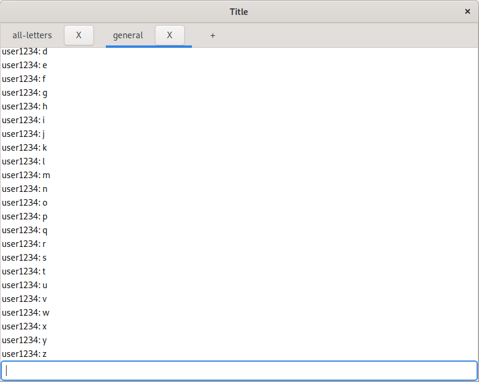
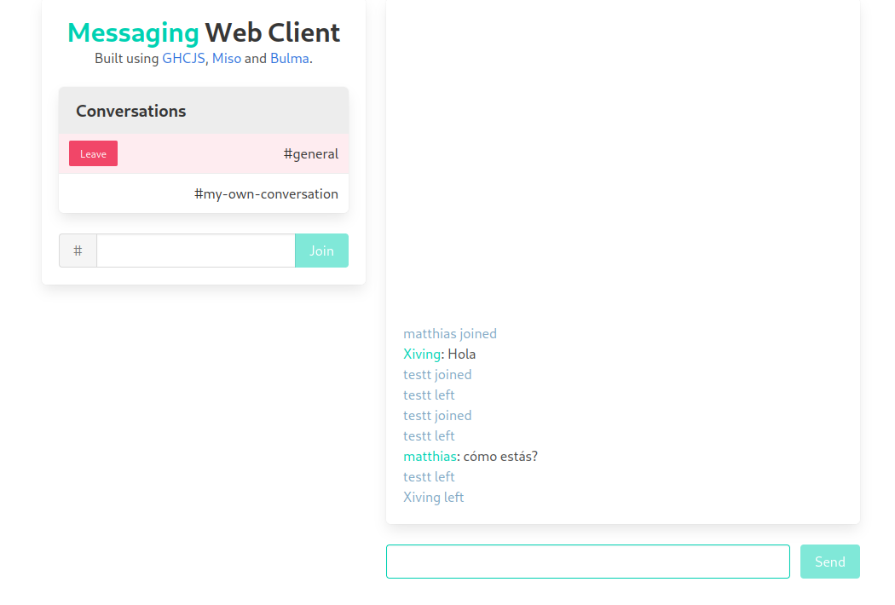

# messaging

A real-time chat application.
Users can connect under a username, join and leave conversations,
and send messages that all other conversation members will receive.

There are plans to add features and explore the privacy and security aspects,
but currently there are many limitations, e.g.:
- No persistence, so users only receive a message if they are online when it is sent,
  and restarting the client loses all conversation history.
- No encryption except for TLS, the server can read your messages.
- Error handling/recovery in the clients is not great.

### Package structures

- **messaging-shared** defines the client-server interface in the form of Request and Response data types
  and how they are serialized.

- **messaging-server (executable)** provides a websocket endpoint clients can connect to.
  It manages users, conversations and most importantly, delivery of messages between the clients.

- **messaging-client-core** contains code to manage UI-independent client state and the websocket
  connection to the server.
  To keep the UI thread responsive, it starts threads for sending and receiving messages,
  and channels to communicate with them.

- **messaging-client-web (executable)** uses GHCJS and Miso to generate a JavaScript client with corresponding HTML/CSS.

- **messaging-client-gtk (executable)** offers a basic cross-platform GTK client.

- **messaging-client-terminal (executable)** offers an ANSI terminal UI client.
  On Windows it’s only usable with the Windows Subsystem for Linux (WSL) due to
  [problems with the GHC runtime system](https://gitlab.haskell.org/ghc/ghc/-/issues/2189)
  (expected to be fixed with the new Windows I/O manager coming in GHC 9.2).

- **ansi-terminal-declarative-simple** is a simple declarative terminal UI framework,
  with an update/view API similar to gi-gtk-declarative-app-simple and miso.

### Demo

Depending on when you are reading this, there might be a server and web client at
<https://mheinzel.com/messaging>.
If so, you can also connect to the server with the native clients
using the `--uri wss://mheinzel.com/api/messaging` option.

Please note that is just a simple demo of a very experimental project,
so don't make any assumptions about its availability, security or privacy.
Use at your own risk and don't do something that forces me to take it offline.

### Build instructions

Most components are straight-forward to build using [Stack](https://docs.haskellstack.org/en/stable/README/).
However, the GTK client requires GTK to be installed on your system and the web client is best built using Nix.

Please check the individual executables' own READMEs for details.

### More screenshots

